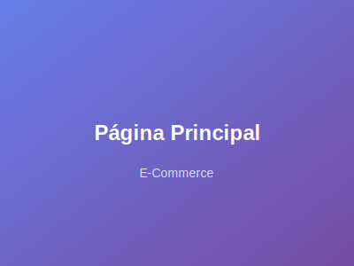

# 📸 Guía para Manejo de Capturas de Pantalla

## 🎯 **Mejores Prácticas Implementadas**

### **1. 📁 Estructura Organizada**
```
img/
├── projects/
│   ├── ecommerce/
│   ├── banking/
│   ├── analytics/
│   ├── cms/
│   ├── gaming/
│   └── cloud/
└── thumbnails/ (para versiones pequeñas)
```

### **2. 🖼️ Formatos Recomendados**

#### **SVG (Actual - RECOMENDADO)**
- ✅ **Ventajas**: 
  - Archivos muy pequeños (~1-2KB)
  - Escalables sin pérdida de calidad
  - Carga instantánea
  - Fácil de personalizar
- ❌ **Desventajas**: 
  - No son capturas reales
  - Solo para placeholders

#### **JPG/PNG (Para Capturas Reales)**
- ✅ **Ventajas**: 
  - Capturas reales del proyecto
  - Mayor credibilidad
- ❌ **Desventajas**: 
  - Archivos más grandes
  - Requieren optimización

### **3. 🚀 Opciones de Implementación**

#### **Opción A: SVG Placeholders (ACTUAL)**
```html

```
- **Tamaño**: ~1-2KB por imagen
- **Carga**: Instantánea
- **Uso**: Perfecto para desarrollo y demos

#### **Opción B: Imágenes Reales Optimizadas**
```html

```
- **Tamaño**: 50-100KB por imagen (optimizada)
- **Carga**: Rápida con lazy loading
- **Uso**: Para portafolio profesional

#### **Opción C: Sistema Híbrido**
```html

```
- **Thumbnail**: 20-30KB
- **Full size**: Solo cuando se necesita
- **Uso**: Máximo rendimiento

### **4. 🛠️ Herramientas Recomendadas**

#### **Para Optimización de Imágenes:**
- **TinyPNG**: Compresión sin pérdida
- **Squoosh**: Herramienta web de Google
- **ImageOptim**: Para Mac
- **GIMP**: Editor gratuito

#### **Para Capturas de Pantalla:**
- **CleanShot X**: Para Mac
- **Snagit**: Profesional
- **Lightshot**: Gratuito
- **Browser DevTools**: Para capturas web

### **5. 📏 Especificaciones Técnicas**

#### **Tamaños Recomendados:**
- **Desktop**: 1200x800px
- **Mobile**: 600x400px
- **Thumbnail**: 400x300px

#### **Calidad de Compresión:**
- **JPG**: 80-85% calidad
- **PNG**: Para capturas con texto
- **WebP**: Para mejor compresión (opcional)

### **6. 🔄 Migración de Placeholders a Imágenes Reales**

#### **Paso 1: Crear las imágenes**
```bash
# Crear directorios
mkdir -p img/projects/ecommerce/full
mkdir -p img/projects/ecommerce/thumbs

# Generar thumbnails
convert hero-full.jpg -resize 400x300 hero-thumb.jpg
```

#### **Paso 2: Actualizar HTML**
```html
<!-- Cambiar de SVG a JPG -->

```

#### **Paso 3: Implementar lazy loading mejorado**
```javascript
// Cargar imagen completa al hacer click
document.querySelectorAll('img[data-full]').forEach(img => {
    img.addEventListener('click', function() {
        this.src = this.dataset.full;
    });
});
```

### **7. 🎨 Personalización de SVGs**

#### **Cambiar Colores:**
```svg
<stop offset="0%" style="stop-color:#667eea;stop-opacity:1" />
<stop offset="100%" style="stop-color:#764ba2;stop-opacity:1" />
```

#### **Cambiar Texto:**
```svg
<text x="50%" y="50%">Tu Texto Aquí</text>
```

### **8. 📱 Responsive Images**

#### **Usando srcset:**
```html

```

### **9. 🚀 Próximos Pasos Recomendados**

1. **Mantener SVGs** para desarrollo rápido
2. **Crear capturas reales** cuando tengas proyectos terminados
3. **Implementar sistema híbrido** para mejor rendimiento
4. **Usar WebP** para máxima optimización
5. **Implementar CDN** para producción

### **10. 💡 Consejos Adicionales**

- **Nombres descriptivos**: `hero.jpg`, `dashboard.jpg`, `mobile-view.jpg`
- **Consistencia**: Mismo estilo visual en todas las capturas
- **Alt text**: Siempre incluir descripciones accesibles
- **Lazy loading**: Implementado por defecto
- **Fallbacks**: SVG como respaldo si falla la carga
